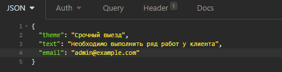
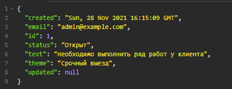
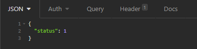
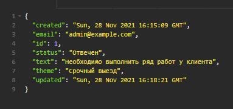
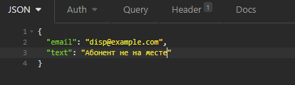
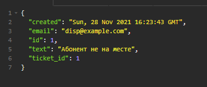
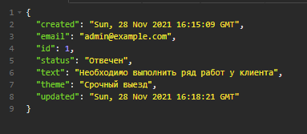

# Flask-RESTful API for ticket system

Main libraries used:
1. Flask-Migrate - for handling all database migrations.
2. Flask_RESTful - restful API library.
3. Flask-SQLAlchemy - adds support for SQLAlchemy ORM.

Project structure:
```buildoutcfg
|- README.md
|- data
|- models
|  |- __init__.py
|  |- database.py
|  |- ticket.py
|  |- ticket_states.py
|- app.ini
|- app.py
|- cache.py
|- config.py
|- docker-compose.yml
|- Dockerfile
|- requirements.txt
|- serializers.py
|- views.py
```
* app.py - flask application initialization.
* views.py - holds all endpoints.

## Running

1. Clone repository.
2. pip install requirements.txt
3. docker-compose up -d --no-deps --build for up uwsgi:app, db, and redis for cache
4. Run following commands:
    1. flask db init
    2. flask db migrate
    3. flask db upgrade


## Usage
### Tickets endpoint
POST http://127.0.0.1:8080/tickets
```buildoutcfg
create ticket
```
REQUEST



RESPONSE



PUT http://127.0.0.1:8080/tickets/1
```buildoutcfg
update status of the ticket
```

REQUEST



RESPONSE



POST http://127.0.0.1:8080/comments/1
```buildoutcfg
create comment to ticket
```

REQUEST



RESPONSE



GET http://127.0.0.1:8080/tickets/1
```buildoutcfg
get a single ticket
```

RESPONSE


